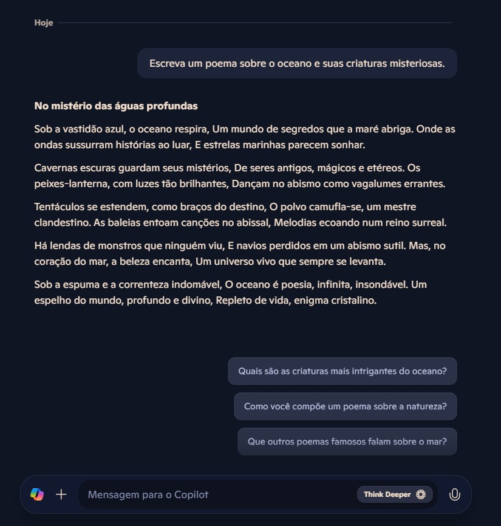
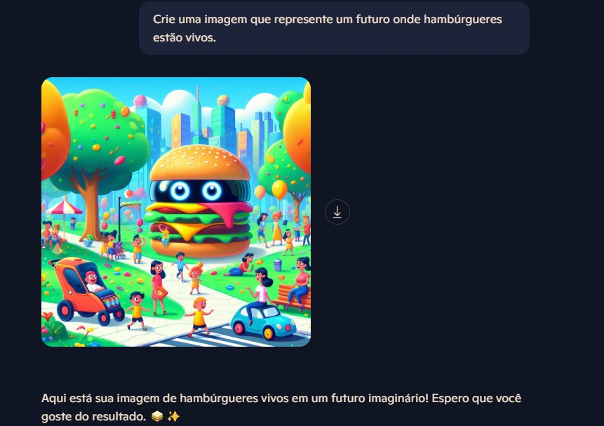
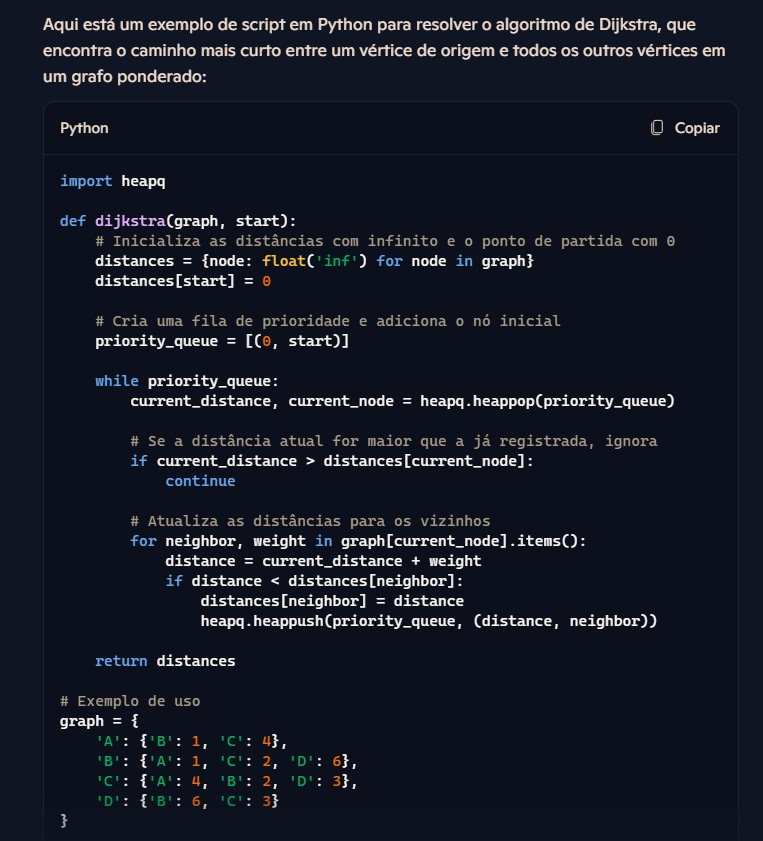
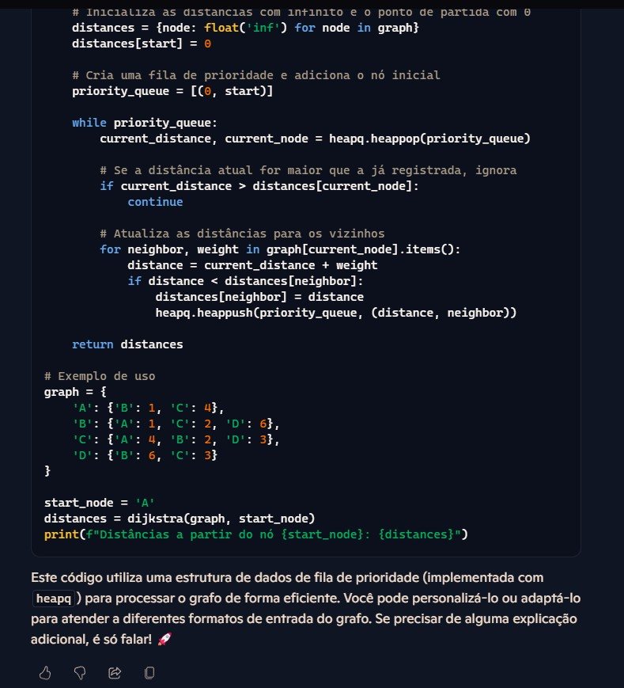

# Explorando IA Generativa com Microsoft Copilot

## Introdução

O objetivo desse laboratório é testar algumas funcionalidades do Microsoft Copilot, IA generativa da Microsoft. Esses procedimentos foram realizados como parte do **Bootcamp Decola Tech, da DIO**.

Esses experimentos foram baseados nos guias da Microsoft Learn. Para informações mais detalhadas, consulte a página [Explore generative AI with Microsoft Copilot](https://microsoftlearning.github.io/mslearn-ai-fundamentals/Instructions/Labs/12-generative-ai.html). Esse readme foi escrito com auxílio de uma IA generativa.

## Procedimento
Para realizar os experimentos aquí mostrados basta acessar o [Microsoft Copilot](https://copilot.microsoft.com), realizar o *login* com uma conta Microsoft e começar a utilizar o *prompt*.

O primeiro teste foi pedir à IA que gerasse um poema sobre o oceano e suas criaturas misteriosas. As Inteligências Artificiais Generativas (IAs generativas) têm a capacidade de criar texto original com base em padrões aprendidos a partir de dados existentes.

  

Uma funcionalidade integrada no Copilot é a possibilidade de geração de imagens.

  

  

Uma outra capacidade das IA's generativas é a de criar código de maneira automatizada, revolucionando o desenvolvimento de aplicativos. Aqui foi requisitado o algoritmo de Dijkstra em python.

  

  

